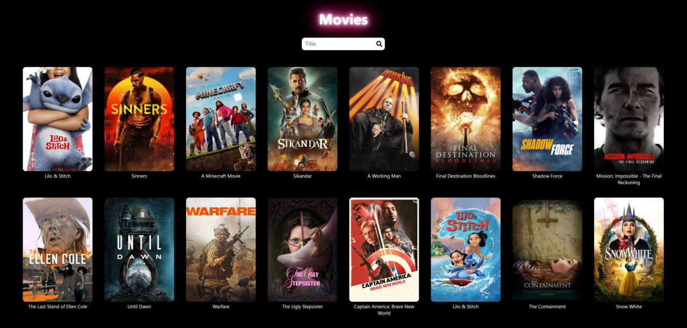

https://movies-yeinier.netlify.app/

# 🎬 Movie Explorer

## 📌 Description
A React-based application that consumes The Movie Database (TMDb) API to display trending movies dynamically. It features a real-time search bar with instant suggestions as you type, and implements infinite scroll to automatically load more movies as the user scrolls down. Clicking on a movie reveals detailed information, including synopsis, rating, and release date. The design is responsive and focused on providing a smooth user experience.

## 🚀 Features
- Real-time movie search with instant results
- Debounced input to reduce API overcalls
- Infinite scrolling of trending movies
- Detailed movie view with overview, rating, and release date
- Responsive grid layout

## 🔧 Technologies Used
- React
- React Router
- Fetch API
- TMDb API
- CSS Modules

## 🖼️ Demo



🔗 [Live Site](https://movies-yeinier.netlify.app/)  
🔗 [GitHub Repo](https://github.com/Yeinier22/movie)

## 📂 Installation
```bash
git clone https://github.com/Yeinier22/movie.git
cd movie-explorer
npm install
npm start
```

> 🛠 If you see ESLint plugin errors after installing, you can fix it with:
> ```bash
> npm install eslint-plugin-import eslint-config-react-app --save-dev
> ```

## 🔐 Environment Variables
After cloning the project, **rename** the file `.env.template` to `.env` in the root directory, and provide the following values:

```
REACT_APP_API=https://api.themoviedb.org/3
REACT_APP_API_TOKEN=your_tmdb_api_token_here
```

You can obtain your API token by:
1. Creating a free account at [https://www.themoviedb.org](https://www.themoviedb.org)
2. Navigating to [https://developer.themoviedb.org](https://developer.themoviedb.org)
3. Creating a new API key or token under your user settings

## 📁 Folder Structure
```bash
src/
├── components/       # MovieCard, search input, etc.
├── hooks/            # Custom hooks (e.g., useDebounce)
├── pages/            # Page views
├── utils/            # Helper functions
├── App.jsx
├── App.module.css
├── index.css
└── index.js
```

## 🧠 Learning & Challenges
- Working with a third-party API (TMDb)
- Implementing infinite scroll using `react-infinite-scroll-component`
- Managing state and side effects with hooks (useState, useEffect)
- Improving performance with debounced search input

## 📜 License
MIT
